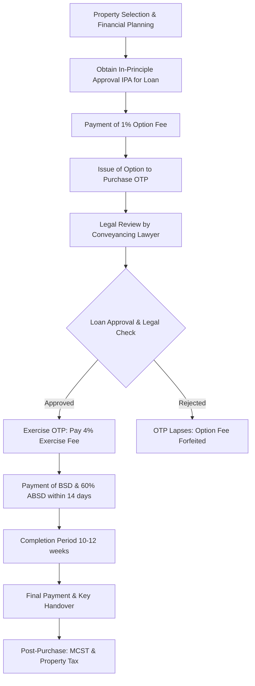

# Document 2A: Legal Process for a Taiwanese National Purchasing Private Residential Property in Singapore

**Title:** Legal Process for a Taiwanese National Purchasing Private Residential Property in Singapore
**Date:** March 2026
**Language:** English

---

## 1. Eligibility
Under the **Residential Property Act**, Taiwanese nationals (and all foreign nationals) have the following restrictions and permissions:
*   **Permitted:** You can purchase units in "Condominiums" and "Apartments" (non-landed residential properties).
*   **Restricted:** You cannot purchase "Landed Properties" (e.g., Terraced houses, Bungalows) or "HDB Flats" (public housing) without specific approval from the Land Dealings Approval Unit (LDAU), which is rarely granted to non-permanent residents.

## 2. Stamp Duties
Purchasing property in Singapore involves two primary taxes:
*   **Buyer's Stamp Duty (BSD):** A progressive tax on the purchase price/market value.
    *   First $180k: 1%
    *   Next $180k: 2%
    *   Next $640k: 3%
    *   Next $500k: 4%
    *   Next $1.5M: 5%
    *   Amount exceeding $3M: 6%
*   **Additional Buyer's Stamp Duty (ABSD):** As of the current cooling measures (2023-2026), Taiwanese nationals (as foreigners) are subject to a flat **60% ABSD** on any residential property purchase.

## 3. Financing
Foreigners are eligible for Singapore bank loans, though the framework is rigorous:
*   **Loan-to-Value (LTV) Limit:** Typically up to **75%** for the first property loan.
*   **TDSR (Total Debt Servicing Ratio):** Total monthly debt obligations (including the new loan) cannot exceed **55%** of gross monthly income.
*   **Tenure:** Up to 30 years or age 65 (whichever is earlier).

## 4. Legal Representation
A **Singapore-qualified conveyancing lawyer** is mandatory to handle the transaction, perform title searches, and coordinate with the Singapore Land Authority (SLA). The typical timeline from "Option to Purchase" (OTP) to "Completion" is **10 to 12 weeks**.

## 5. CPF (Central Provident Fund)
Foreigners (non-Singapore Citizens/PRs) **cannot** use CPF for property purchases. All payments (downpayment and monthly mortgage) must be made via cash or bank loan.

## 6. Remittance & FX
*   **Taiwan Regulations:** Individuals in Taiwan have an annual limit of **US$5 million** for outward foreign exchange remittances. Transfers exceeding this require reporting to the Central Bank of the Republic of China (Taiwan).
*   **Transfer:** Funds are typically transferred via SWIFT from a Taiwanese bank to the lawyer's conveyancing account in Singapore to ensure transparency and compliance with Anti-Money Laundering (AML) laws.
*   **FX Risk:** Conversion from TWD to SGD should be timed carefully; some buyers maintain SGD accounts to mitigate volatility.

## 7. Post-purchase Obligations
*   **Property Tax:** Non-owner-occupied rates apply if the unit is rented out (progressive rates).
*   **Income Tax:** Non-resident owners are taxed at a flat **24%** on net rental income.
*   **MCST Fees:** Monthly or quarterly maintenance fees to the Management Corporation Strata Title (MCST) for facilities and sinking funds.

## 8. Exit
*   **Seller's Stamp Duty (SSD):** If the property is sold within the first 3 years:
    *   Sold in 1st year: 12%
    *   Sold in 2nd year: 8%
    *   Sold in 3rd year: 4%
*   **Capital Gains:** Singapore **does not** impose a capital gains tax.
*   **Repatriation:** Funds from the sale can be freely repatriated back to Taiwan after settling the outstanding mortgage and taxes.

---

## Purchase Process Flowchart

