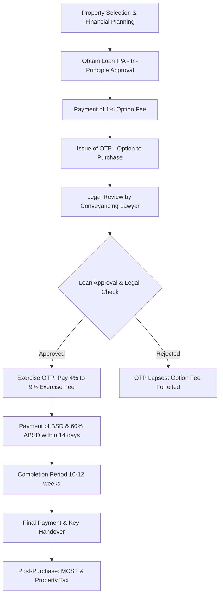

# Document 2A: Legal Process for a Taiwanese National Purchasing Private Residential Property in Singapore

**Title:** Legal Process for a Taiwanese National Purchasing Private Residential Property in Singapore
**Date:** March 2026
**Language:** English

---

## 1. Eligibility
Under the **Residential Property Act**, Taiwanese nationals (and all foreign nationals) have the following restrictions and permissions:
*   **Permitted:** You can purchase units in "Condominiums" and "Apartments" (non-landed residential properties).
*   **Restricted:** You cannot purchase "Landed Properties" (e.g., Terraced houses, Bungalows) or **HDB (Housing & Development Board)** Flats (public housing) without specific approval from the **LDAU (Land Dealings Approval Unit)**, which is rarely granted to non-permanent residents.

## 2. Stamp Duties
Purchasing property in Singapore involves two primary taxes:
*   **BSD (Buyer's Stamp Duty):** A progressive tax on the purchase price or market value.
    *   First S$180,000: 1%
    *   Next S$180,000: 2%
    *   Next S$640,000: 3%
    *   Next S$500,000: 4%
    *   Next S$1.5 Million: 5%
    *   Amount exceeding S$3 Million: 6%
*   **ABSD (Additional Buyer's Stamp Duty):** As of the current cooling measures (2023-2026), Taiwanese nationals (as foreigners) are subject to a flat **60% ABSD** on any residential property purchase.
    *   **ABSD Exception (FTA - Free Trade Agreement):** Under Free Trade Agreements, nationals or Permanent Residents of **Iceland, Liechtenstein, Norway, Switzerland, and USA** are eligible for the same stamp duty treatment as Singapore Citizens (0% ABSD for the first residential property). If the buyer holds dual nationality or Permanent Residency from these countries, they may qualify for this remission.

## 3. Financing
Foreigners are eligible for Singapore bank loans, though the framework is rigorous:
*   **LTV (Loan-to-Value) Limit:** Typically up to **75%** for the first property loan.
*   **TDSR (Total Debt Servicing Ratio):** Total monthly debt obligations (including the new loan) cannot exceed **55%** of gross monthly income.
*   **Tenure:** Up to 30 years or age 65 (whichever is earlier).

## 4. Legal Representation
A **Singapore-qualified conveyancing lawyer** is mandatory to handle the transaction, perform title searches, and coordinate with the **SLA (Singapore Land Authority)**. The typical timeline from **OTP (Option to Purchase)** to **Completion** is **10 to 12 weeks**.

## 5. CPF (Central Provident Fund)
Foreigners (non-Singapore Citizens or Permanent Residents) **cannot** use **CPF (Central Provident Fund)** for property purchases. All payments (downpayment and monthly mortgage) must be made via cash or bank loan.

## 6. Remittance & FX (Foreign Exchange)
*   **Taiwan Regulations:** Individuals in Taiwan have an annual limit of **US$5 Million** for outward foreign exchange remittances. Transfers exceeding this require reporting to the **Central Bank of the Republic of China (Taiwan)**.
*   **Transfer:** Funds are typically transferred via **SWIFT (Society for Worldwide Interbank Financial Telecommunication)** from a Taiwanese bank to the lawyer's conveyancing account in Singapore to ensure transparency and compliance with **AML (Anti-Money Laundering)** laws.
*   **FX Risk:** Conversion from **TWD (New Taiwan Dollar)** to **SGD (Singapore Dollar)** should be timed carefully; some buyers maintain SGD accounts to mitigate volatility.

## 7. Post-purchase Obligations
*   **Property Tax:** Non-owner-occupied rates apply if the unit is rented out (progressive rates).
*   **Income Tax:** Non-resident owners are taxed at a flat **24%** on net rental income.
*   **MCST (Management Corporation Strata Title) Fees:** Monthly or quarterly maintenance fees to the **MCST (Management Corporation Strata Title)** for facilities and sinking funds.

## 8. Exit
*   **SSD (Seller's Stamp Duty):** If the property is sold within the first 3 years:
    *   Sold in 1st year: 12%
    *   Sold in 2nd year: 8%
    *   Sold in 3rd year: 4%
*   **Capital Gains:** Singapore **does not** impose a capital gains tax. However, the **IRAS (Inland Revenue Authority of Singapore)** may tax gains as income if they determine the individual has "Trading Intent" (frequent flipping of properties).
*   **Repatriation:** Funds from the sale can be freely repatriated back to Taiwan after settling the outstanding mortgage and taxes.

---

## Purchase Process Flowchart

