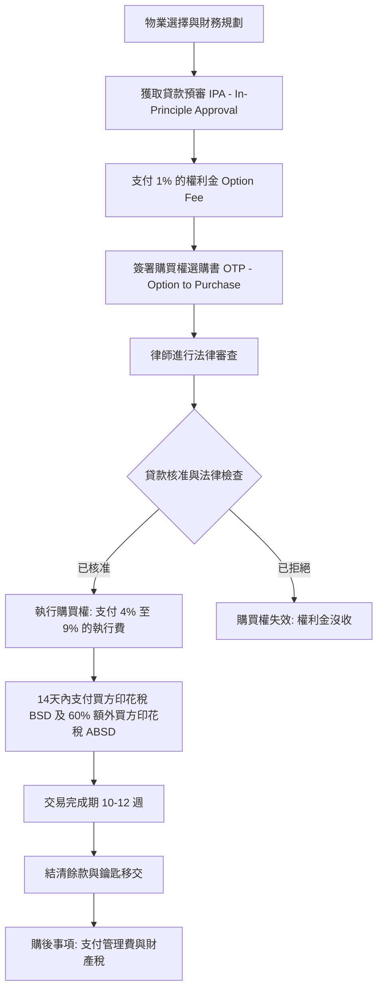

# 文件 2B：台灣國民在新加坡購買私人住宅物業的法律程序

**標題：** 台灣國民在新加坡購買私人住宅物業的法律程序
**日期：** 2026年3月
**語言：** 繁體中文（台灣標準）

---

## 1. 購買資格 (Eligibility)
根據新加坡《住宅物業法》(Residential Property Act)，台灣國民（及所有外國人）具有以下限制與許可：
*   **許可：** 您可以購買「私人公寓」(Condominiums) 和「公寓」(Apartments)（即非土地住宅物業）。
*   **限制：** 未經**土地交易審批局 (Land Dealings Approval Unit, LDAU)** 特別批准，您不得購買「有期地契或永久地契的土地住宅」(Landed Properties)（如排屋、洋房）或**「政府組屋」(HDB, Housing & Development Board Flats)**。通常 LDAU 極少批准**非永久居民 (Non-PR, Non-Permanent Resident)** 的申請。

## 2. 印花稅 (Stamp Duties)
在新加坡購買物業涉及兩項主要稅收：
*   **買方印花稅 (BSD)：** 根據購買價格或市場價值的累進稅率。
    *   首 18 萬新元：1%
    *   次 18 萬新元：2%
    *   次 64 萬新元：3%
    *   次 50 萬新元：4%
    *   次 150 萬新元：5%
    *   超過 300 萬新元的部分：6%
*   **ABSD (額外買方印花稅, Additional Buyer's Stamp Duty)：** 根據目前的降溫措施（2023-2026年），台灣國民（視同外國人）在購買任何住宅物業時，均須繳納 **60% 的額外買方印花稅 (ABSD)**。
    *   **ABSD 豁免條款 (FTA - 自由貿易協定)：** 根據**自由貿易協定 (FTA, Free Trade Agreement)**，若身兼 **冰島、列支敦斯登、挪威、瑞士或美國** 的國民或永久居民，可享有與新加坡公民同等的待遇（首套住宅 0% ABSD）。若買家具備雙重國籍或上述國家的永久居留權，可能符合此減免資格。

## 3. 融資與貸款 (Financing)
外籍人士有資格申請新加坡銀行貸款，但審核框架非常嚴格：
*   **LTV (貸款與估值比率, Loan-to-Value) 限制：** 首套住房貸款通常最高可達 **75%**。
*   **TDSR (總償債率, Total Debt Servicing Ratio)：** 每月總債務償還額（包括新貸款）不得超過月總收入的 **55%**。
*   **貸款期限：** 最長 30 年或直到 65 歲（以較早者為準）。

## 4. 法律代表 (Legal Representation)
必須聘請一名 **具備新加坡執業資格的房地產律師 (Conveyancing Lawyer)** 來處理交易、進行產權調查並與**新加坡土地管理局 (SLA, Singapore Land Authority)** 協調。從 **OTP (購買權選購書, Option to Purchase)** 到 **Completion (完成交易)** 的典型流程約需 **10 至 12 週**。

## 5. CPF (公積金, Central Provident Fund)
外籍人士（非新加坡公民或永久居民）**不能** 使用**公積金 (CPF, Central Provident Fund)** 購買物業。所有款項（首期款及每月房貸）必須以現金或銀行貸款支付。

## 6. 匯款與匯率 (Remittance & FX - 匯率, Foreign Exchange)
*   **台灣法規：** 台灣個人每年累積結匯金額上限為 **500 萬美元**。超過此金額的轉帳需向**中華民國（台灣）中央銀行**申報。
*   **轉帳方式：** 款項通常透過 **SWIFT (全球銀行金融電信協會)** 從台灣銀行轉入新加坡律師的託管帳戶 (Conveyancing Account)，以確保透明度並符合 **AML (反洗錢, Anti-Money Laundering)** 法規。
*   **匯率風險：** 台幣 (**TWD, New Taiwan Dollar**) 兌換新元 (**SGD, Singapore Dollar**) 應謹慎選擇時機；部分買家會持有新元帳戶以減輕波動影響。

## 7. 購後義務 (Post-purchase Obligations)
*   **財產稅 (Property Tax)：** 若物業出租，適用於「非自住」稅率（累進稅率）。
*   **所得稅 (Income Tax)：** 非居民業主的淨租金收入須繳納 **24%** 的固定稅率所得稅。
*   **MCST (公寓管理委員會, Management Corporation Strata Title) 費用：** 每月或每季向 **MCST (公寓管理委員會)** 支付管理費和償債基金 (Sinking Fund)，用於維護設施。

## 8. 退出機制 (Exit)
*   **SSD (賣方印花稅, Seller's Stamp Duty)：** 若在購入後 3 年內出售物業：
    *   第 1 年內出售：12%
    *   第 2 年內出售：8%
    *   第 3 年內出售：4%
*   **資本利得稅：** 新加坡 **不徵收** 資本利得稅。但需注意，若被**稅務局 (IRAS, Inland Revenue Authority of Singapore)** 認定為具有「交易意圖」(Trading Intent)（如頻繁短期買賣），獲利部分可能被視為收入並課稅。
*   **資金匯回：** 在結清未償貸款和稅款後，出售所得資金可自由匯回台灣。

---

## 購買流程流程圖

